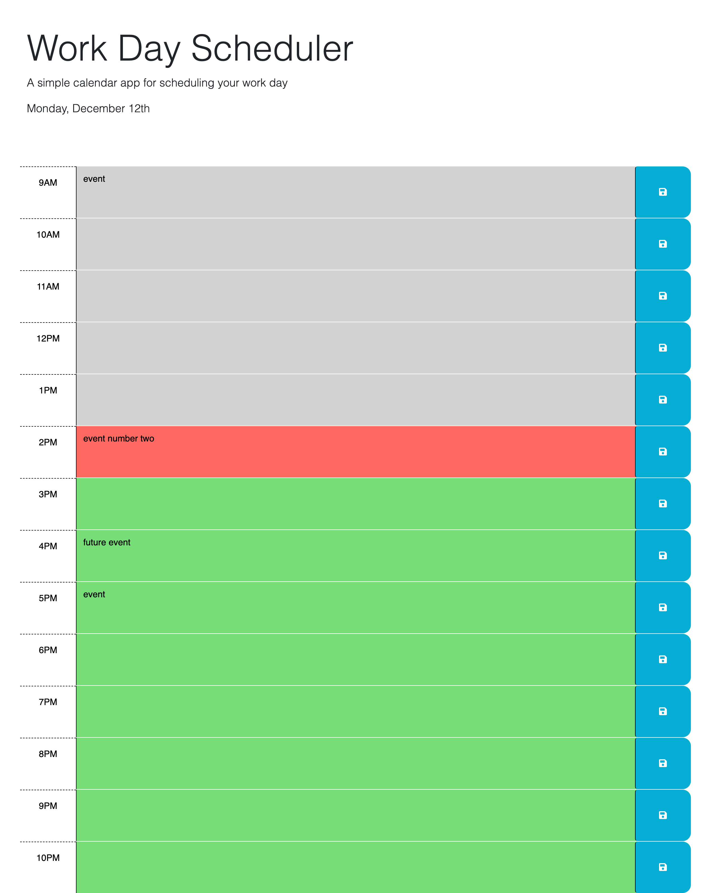

# Wordkay-Calendar
A calendar that allows for setting events per time during one day.

## Description

This is a project that allows a user to add events to a workday calendar. The user is able to input text at time blocks for each hour between 9am and 10pm. Users are able to save the event and see the data persist after page is reloaded. The time slots are color coded: grey for past events, red for current event, and green for future events. The current day and date is displayed at the top of the page.

## Installation

Just need to download the source files from the github repository onto local. Open repository in VSCode and right click on index.html file and select "Open with Live Server". 

## Usage

The user is able to input text at time blocks for each hour between 9am and 10pm. Users are able to save the event and see the data persist after page is reloaded. 

To view this application on Github Pages click [here](https://github.com/GarrettAnderson/workday-calendar).

Below are screenshots of the project:

## Credits

Used the following as references to help with the project:

* [stackoverflow](https://stackoverflow.com/questions/49245033/javascript-generate-array-of-hours-in-the-day-starting-with-current-hour)

* [convertTime](https://www.folkstalk.com/2022/10/how-to-conver-time-format-to-12-hours-in-javascript-with-code-examples.html)

## License

There is no license and this repo is available for reproduction.

